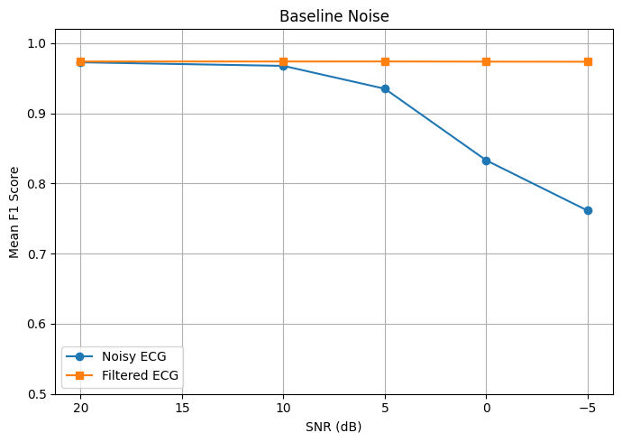
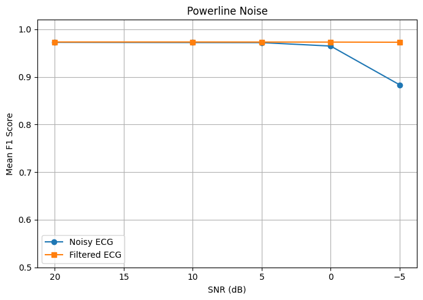
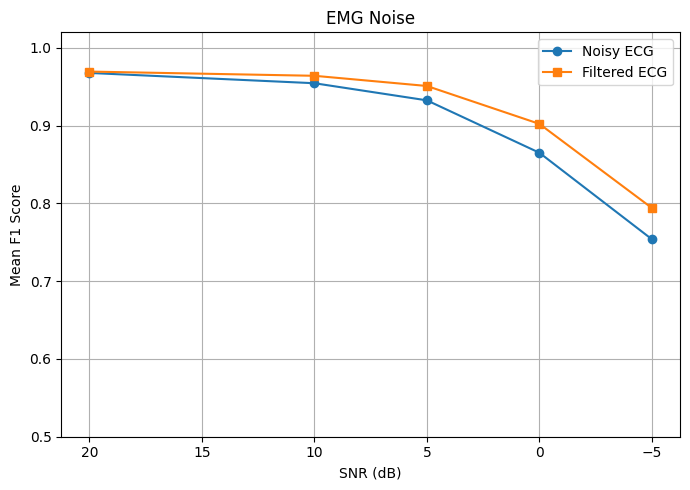
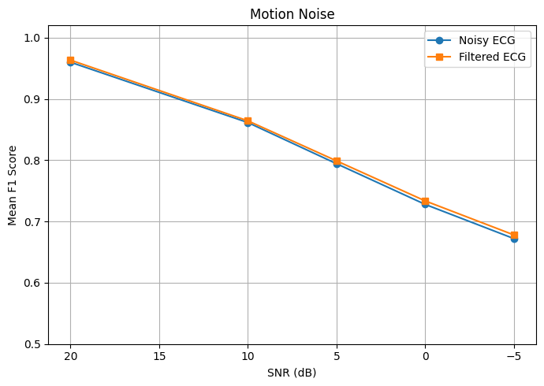

# ECG-Robustness-Under-Noise
# Robust ECG Analysis Under Noise

## Overview

This project investigates how reliably ECG R-peaks can be detected when the signal is contaminated by different types and levels of noise.

ECG signals from the **St. Petersburg INCART 12-lead Arrhythmia Database** were analyzed using Python. Different noise types were simulated at controlled signal-to-noise ratio (SNR) levels, followed by digital filtering and quantitative evaluation of R-peak detection performance.

## Objective

The main question of this project is:

**How reliably can ECG information be extracted when the signal is contaminated?**

The analysis focuses on how noise type and noise intensity affect R-peak detection and how effectively digital filtering can recover detection performance.

## Dataset

**St. Petersburg INCART 12-lead Arrhythmia Database (PhysioNet)**

- Sampling frequency: **257 Hz**
- ECG leads: 12
- Lead used in this project: **Lead II**
- Recording duration: **30 minutes per record**
- Reference beat annotations were used as ground truth.

Ten INCART recordings were initially evaluated. For the robustness experiment, six recordings with baseline R-peak detection **F1 ≥ 0.90** were retained:

`I01, I02, I03, I06, I07, I08`

## Processing Pipeline

The main analysis pipeline was:

```text
ECG signal
    ↓
R-peak detection
    ↓
Noise simulation
    ↓
SNR control
    ↓
Digital filtering
    ↓
R-peak detection
    ↓
Comparison with reference annotations
    ↓
Sensitivity, Precision and F1 score
```

## R-Peak Detection

A Pan-Tompkins-inspired processing pipeline was implemented using:

1. 5–15 Hz Butterworth band-pass filtering
2. Differentiation
3. Squaring
4. Moving-window integration
5. Threshold-based peak detection
6. Local QRS/R-peak localization

Detected peaks were compared with the reference annotations using a **±150 ms matching tolerance**.

Performance was quantified using:

- Sensitivity
- Precision
- F1 score

## Noise Simulation

Four types of ECG contamination were investigated:

- **Baseline wander** – low-frequency 0.3 Hz interference
- **Power-line interference** – 50 Hz sinusoidal interference
- **EMG-like noise** – band-limited high-frequency random noise
- **Motion artifact** – low-frequency random disturbance

Each noise type was scaled to five SNR levels:

**20, 10, 5, 0 and -5 dB**

Lower SNR represents stronger contamination.

## Filtering

Noise-specific digital filters were applied:

- Baseline wander → high-pass filtering
- Power-line interference → 50 Hz notch filtering
- EMG noise → low-pass filtering
- Motion artifact → high-pass filtering

Performance before and after filtering was then compared.

## Experimental Design

The final robustness experiment included:

- 6 ECG recordings
- 4 noise types
- 5 SNR levels

This resulted in:

**6 × 4 × 5 = 120 experimental conditions**

Results were summarized across the six recordings using **mean ± standard deviation**.

## Results

### Performance at Severe Noise (-5 dB)

| Noise Type | F1 Noisy | F1 Filtered | Improvement |
|---|---:|---:|---:|
| Baseline wander | 0.761 | **0.974** | +0.212 |
| Power-line interference | 0.883 | **0.973** | +0.089 |
| EMG | 0.754 | **0.794** | +0.040 |
| Motion artifact | 0.672 | **0.678** | +0.006 |

### Baseline Wander



Baseline wander increasingly degraded R-peak detection as SNR decreased. High-pass filtering was highly effective and maintained an average F1 score of approximately **0.97**, even under severe contamination.

### Power-Line Interference



The detector remained relatively robust to moderate power-line interference. At severe contamination (-5 dB), performance decreased substantially, while 50 Hz notch filtering restored the mean F1 score to approximately **0.97**.

### EMG Noise



EMG contamination progressively reduced detection performance as SNR decreased. Low-pass filtering improved performance, particularly at lower SNR levels, but did not completely recover the original detection accuracy.

### Motion Artifact



Motion artifact produced strong degradation in R-peak detection. The simple high-pass filtering approach provided only a small improvement, demonstrating that motion artifacts are more difficult to suppress using conventional filtering alone.

## Key Findings

1. R-peak detection performance generally decreased as SNR decreased.
2. The effect of contamination depended strongly on the **type of noise**.
3. Baseline wander was effectively removed using high-pass filtering.
4. 50 Hz power-line interference was effectively suppressed using notch filtering.
5. EMG filtering provided partial recovery under severe contamination.
6. Motion artifacts were the most difficult to correct using the simple filtering approach used in this project.
7. Stronger noise also increased variability in detection performance between ECG recordings.

## Limitations

The simulated noise models are simplified representations of real physiological and acquisition artifacts.

The custom R-peak detector did not perform equally well across all INCART recordings. Therefore, the robustness analysis was restricted to recordings with baseline F1 ≥ 0.90. The reported robustness results consequently represent recordings for which the baseline detector already provided reliable detection.

The motion-artifact filtering strategy was intentionally simple and was not sufficient to fully recover R-peak detection performance under strong motion contamination.

## Conclusion

The results demonstrate that ECG R-peak detection robustness depends on both **noise intensity and noise type**.

Conventional digital filtering can provide strong protection against structured interference such as baseline wander and power-line noise. However, complex contamination such as EMG activity and particularly motion artifacts remains more challenging.

This highlights the importance of artifact-specific signal-processing strategies when developing reliable ECG analysis systems for real-world biomedical applications.

## Tools and Libraries

- Python
- Google Colab
- NumPy
- SciPy
- Pandas
- Matplotlib
- WFDB

## Skills Demonstrated

- Biomedical signal processing
- ECG analysis
- Digital filtering
- R-peak detection
- Noise simulation
- Signal-to-noise ratio (SNR) analysis
- Algorithm performance evaluation
- Sensitivity, precision and F1 analysis
- Multi-record experimental analysis
- Scientific data visualization
